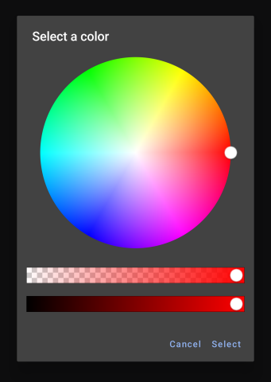

# Ti.ColorPicker

Support color pickers in Titanium Mobile. The iOS module bridges [RSColorPicker](https://github.com/RSully/RSColorPicker), thank you @RSully! For Android it is using [ColorPickerView](https://github.com/skydoves/ColorPickerView) by skydoves.

## Usage

```js
var win = Ti.UI.createWindow();
var ColorPicker = require("ti.colorpicker");

var picker = ColorPicker.createColorPickerView({
    width: 300,
    height: 300,
    top: 30,
// -- Colorpicker-specific properties
//  opacity: 1.0,
//  brightness: 1.0,
//  cropToCircle: false,
//  showLoupe: true
});

picker.addEventListener("selection", function(e) {
    Ti.API.warn(e.color);
    result.setBackgroundColor(e.color);
});

var result = Ti.UI.createView({
    bottom: 20,
    height: 50,
    width: 300,
    backgroundColor: "lightgray"
});

win.add(result);
win.add(picker);
win.open();
```

## Android



```js
var ColorPicker = require("ti.colorpicker");
ColorPicker.showColorPicker({
  onSelect: function(event) {
    console.log(event.color)
  }
})
```
showColorPicker() parameters:
* <b>title</b> (string): dialog title
* <b>selectionColor</b> (string): default color value
* <b>selectButtonTitle</b> (string): select button text
* <b>cancelButtonTitle</b> (string): cancel button text
* <b>alphaSlider</b> (boolean): show alpha slider
* <b>brightnessSlider</b> (boolean): show brightness slider
* <b>onSelect</b> (function): success callback


## Copyright

&copy; 2016 by Hans Knoechel
